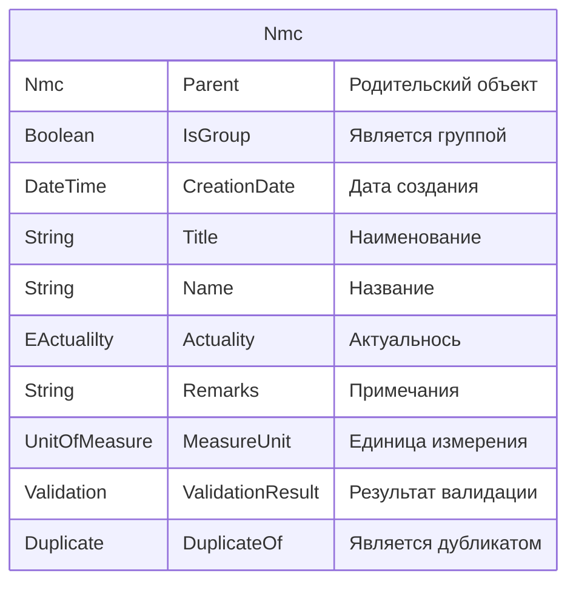
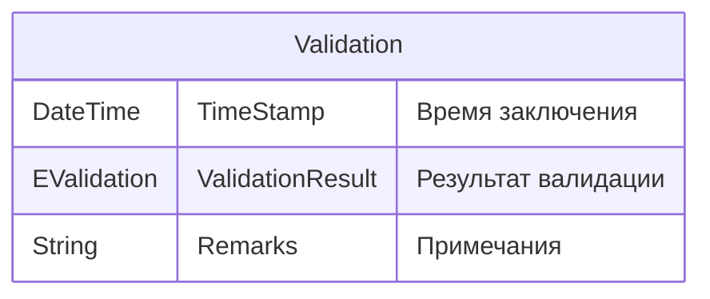
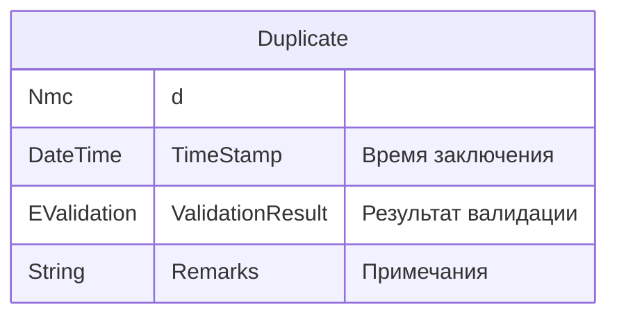
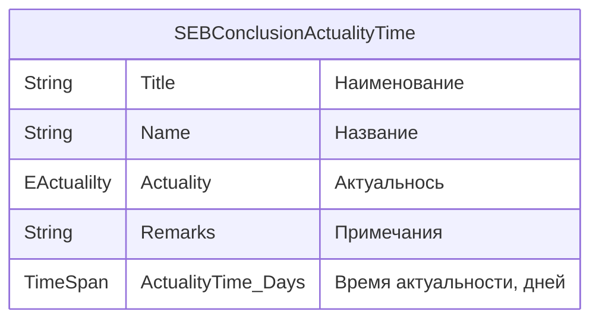

# DataModel

* [Номенклатура](./Ojb__NmcCategory.md)

```mermaid
erDiagram
  Nmc {
    Nmc Parent "Родительский объект"
    Boolean IsGroup "Является группой"
    DateTime CreationDate "Дата создания"
    String Title "Наименование"
    String Name "Название"
    EActualilty Actuality "Актуальнось"    
    String Remarks "Примечания"
    UnitOfMeasure MeasureUnit "Единица измерения"
    Validation ValidationResult "Результат валидации"
    Duplicate DuplicateOf "Является дубликатом"
  }
```

```mermaid
erDiagram
  Validation {
    DateTime TimeStamp "Время заключения"
    EValidation ValidationResult "Результат валидации"    
    String Remarks "Примечания"
  }
```

```mermaid
erDiagram
  Duplicate {
    Nmc d
    DateTime TimeStamp "Время заключения"
    EValidation ValidationResult "Результат валидации"    
    String Remarks "Примечания"
  }
```

* [Срок актуальности заключения СЕБ](./Ojb__SEBConclusionActualityTime.md)

```mermaid
erDiagram
  SEBConclusionActualityTime {
    String Title "Наименование"
    String Name "Название"
    EActualilty Actuality "Актуальнось"
    String Remarks "Примечания"
    TimeSpan ActualityTime_Days "Время актуальности, дней"    
  }
```
