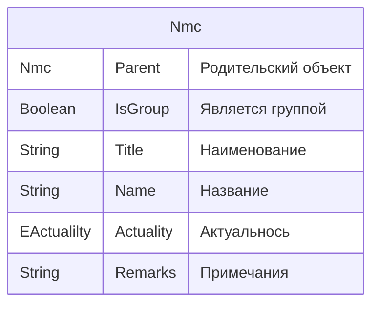
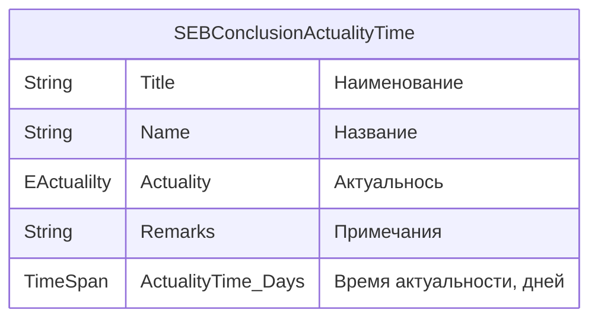

# DataModel

* [Категория номенклатуры](./Ojb__NmcCategory.md)

```mermaid
erDiagram
  Nmc {
    Nmc Parent "Родительский объект"
    Boolean IsGroup "Является группой"
    String Title "Наименование"
    String Name "Название"
    EActualilty Actuality "Актуальнось"    
    String Remarks "Примечания"
  }
```

* [Срок актуальности заключения СЕБ](./Ojb__SEBConclusionActualityTime.md)

```mermaid
erDiagram
  SEBConclusionActualityTime {
    String Title "Наименование"
    String Name "Название"
    EActualilty Actuality "Актуальнось"
    String Remarks "Примечания"
    TimeSpan ActualityTime_Days "Время актуальности, дней"    
  }
```
