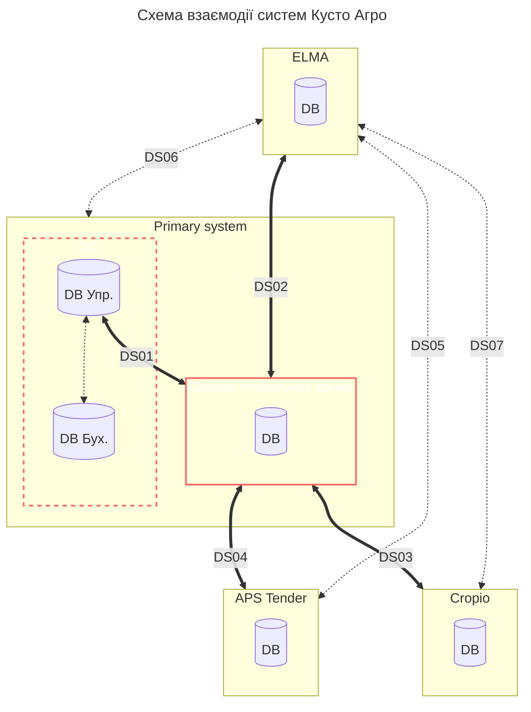

# [Сервер глобальних даних](Kusto/Documents/20230519__GlobalDataServer.md)

**Перелік глобальних даних, що синхронізіються між `1С` та Сервером глобальних даних: (далі `GDS` або `Global Data Server`)**
| Що буде передаватись між `1C` та | `GDS` |
| --- | :---: |
| Робітник | :heavy_check_mark: |
| Посада | :heavy_check_mark: |
| Підприємство | :heavy_check_mark: |
| Стаття б'юджету | :heavy_check_mark: |
| Группа номенклатури | :heavy_check_mark: |
| Номенклатура | :heavy_check_mark: |

| Що буде передаватись між `GDS` та | `ELMA` | `APS Tender` | `Cropio` |
| --- | :---: | :---: | :---: |
| Робітник | :heavy_check_mark: |  |  |
| Посада | :heavy_check_mark: |||
| Підприємство | :heavy_check_mark: |||
| Стаття б'юджету | :heavy_check_mark: |||
| Группа номенклатури | :heavy_check_mark: |||
| Номенклатура | :heavy_check_mark: |||

